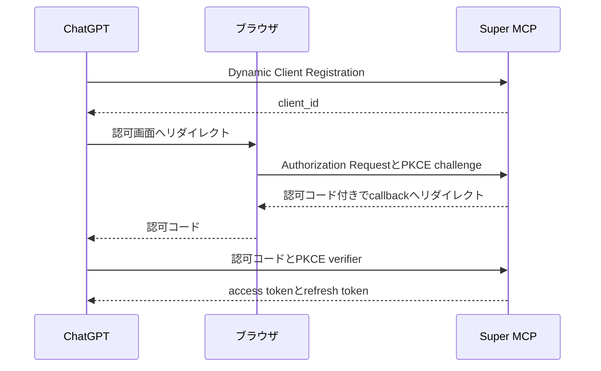
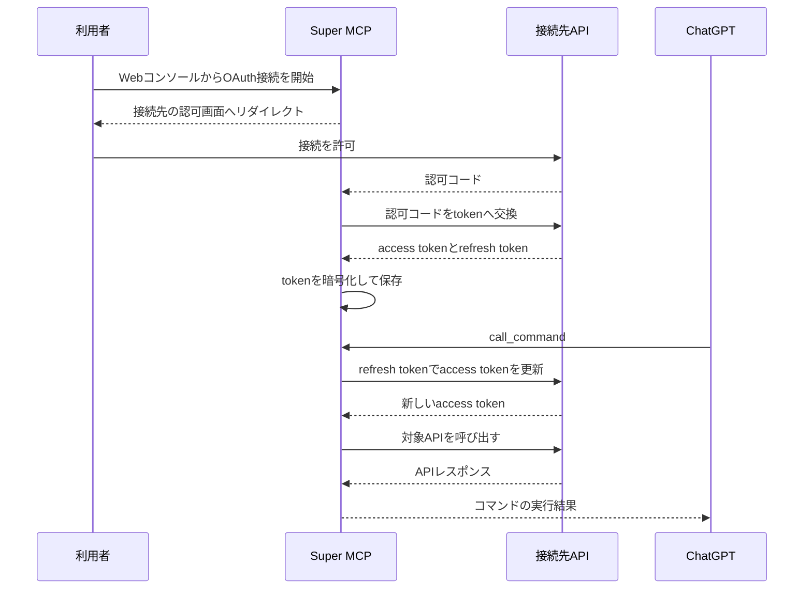

個人開発で小さなAPIを作ることが増えた。

WebページをMarkdownへ変換するAPI、各種サービスのデータをGoogle Sheetsへ同期するAPIなど、用途はそれぞれ異なる。

これらをChatGPTから呼べるようにするには、APIごとにMCP endpointを実装し、ChatGPTの開発者モードへ追加すればよい。

実際、最初の一つはそれで困らなかった。

しかし、APIが増えると次の作業を繰り返すことになる。

- MCP endpointを実装する。
- ChatGPTへ接続するためのOAuthを実装する。
- 開発者モードで接続先を追加する。
- 接続先APIのAPIキーやOAuth tokenを管理する。

API本体の規模にかかわらず、ChatGPTから利用可能にするための実装と設定は発生する。

そこで、ChatGPTには一つのMCPサーバーだけを接続し、その先へAPIを追加できる仕組みを作った。

名前は「Super MCP」とした。

## 開発者モードで増えていく接続設定

ChatGPTの開発者モードでは、独自のMCPサーバーをアプリとして登録してテストできる。

登録時にはMCP endpointと認証方式を設定し、ChatGPTが公開されているMCPツールを読み取る。

詳しい手順と利用条件は[OpenAIの公式ヘルプ](https://help.openai.com/en/articles/12584461-developer-mode-and-mcp-apps-in-chatgpt)にまとまっている。

私はこの機能を使い、自作したMCPサーバーを自分用のアプリとして追加していた。

作ったMCPサーバーをApp Directoryへ公開していたわけではない。

この方法では、自作APIとChatGPTが一対一で対応する。

たとえば三つのAPIを使うなら、三つのMCP endpointと三つの接続設定を管理する。

接続先APIがOAuthを要求する場合は、access tokenの取得、保存、更新もそれぞれに必要になる。

その理由は「MCPサーバーの実装が難しいから」ではない。

どのAPIもChatGPTとの接続と接続先への認証を必要とし、その実装をAPIごとに持たせていたからだ。

## APIを追加できる一つのMCPサーバー

Super MCPは、ChatGPTと複数のHTTP APIの間に置くMCPサーバーである。

WebコンソールからAPIのベースURL、OpenAPI、接頭辞、認証情報を登録すると、Super MCPがそのAPIをMCPコマンドとして公開する。

この記事では、このように別のAPIを後から組み込めるMCPサーバーを**メタMCP**と呼ぶ。


ChatGPTから見える接続先はSuper MCPだけである。

APIを追加したときに更新するのはSuper MCPの設定であり、ChatGPTへ新しいMCPサーバーを登録する必要はない。

ここでいう「任意のAPI」には条件がある。

- HTTPで呼び出せる。
- OpenAPIで操作を記述できる。
- 固定ヘッダーまたはOAuth 2.0で認証できる。

OpenAPIを持たないAPIや、MCPのresource、prompt、samplingといった機能を使うサーバーは対象外である。

Super MCPはMCPサーバーを任意に多段接続する仕組みではなく、OpenAPIで記述されたHTTP APIをMCPツールへ変換する仕組みだ。

## OpenAPIからMCPコマンドを生成する

接続先ごとの実装を減らすため、Super MCPはOpenAPIをAPIとの契約として使う。

たとえば、次のようなoperationがあるとする。

```yaml
paths:
  /fetch:
    post:
      operationId: fetchPage
      summary: URLから本文を取得する
      requestBody:
        required: true
        content:
          application/json:
            schema:
              type: object
              properties:
                url:
                  type: string
                  format: uri
              required: [url]
      responses:
        '200':
          description: 取得結果
```

接頭辞として`page-kit`を設定すると、Super MCPはこのoperationを`page-kit__fetchPage`というコマンドへ変換する。

コマンド名には`operationId`を使い、複数API間の衝突を避けるために接頭辞を付ける。

入力スキーマはpath、query、header、request bodyから組み立てる。

responseにJSON Schemaがあれば、MCPツールの出力スキーマにも変換する。

MCPのツール定義が持つ`inputSchema`や`annotations`については、[MCPのTools仕様](https://modelcontextprotocol.io/specification/2025-11-25/server/tools)を参照できる。

実行時には引数をOpenAPI上の位置へ振り分け、HTTPリクエストを作る。

```json
{
  "name": "page-kit__fetchPage",
  "arguments": {
    "requestBody": {
      "url": "https://example.com"
    }
  }
}
```

この例なら、Super MCPは`POST /fetch`のJSON bodyへ`requestBody`を入れる。

Webコンソールで登録した認証ヘッダーは入力スキーマから除外し、APIを呼び出す直前にSuper MCPが付与する。

モデルへAPIキーを渡さずに済み、利用者がプロンプトへ認証情報を書く必要もない。

### OpenAPIを変換するときの落とし穴

OpenAPIの`paths`配下にあるキーが、すべてHTTPメソッドとは限らない。

Path Itemには`parameters`、`summary`、`description`、`$ref`も置けるため、HTTPメソッドだけを選ばずにparseすると正しい定義まで弾いてしまう。

path階層とoperation階層の両方に`parameters`がある場合は、後者で前者を上書きする形でマージする必要もある。

URLの解決にも罠があった。

```ts
new URL('openapi.json', 'https://api.example.com/v1').toString()
// https://api.example.com/openapi.json
```

ベースURLの末尾に`/`がなければ、`v1`はディレクトリではなくファイル名として扱われる。

Super MCPではベースURLを正規化してからOpenAPIの相対パスを解決している。

汎用的な変換処理では、こうした例外を接続先ごとの修正へ逃がせない。

同じ入力から同じコマンドを生成できるよう、`operationId`の欠落と重複も登録時にエラーとしている。

## MCPツールをコマンドへ畳む

OpenAPIのoperationをそのままMCPツールとして公開する実装も試した。

この方式は単純だが、APIを追加するたびに`tools/list`の結果が増える。

各ツールには名前と説明だけでなく入力スキーマも含まれるため、接続先を増やすほどChatGPTへ渡す定義も大きくなる。

そこで、現在のSuper MCPが直接公開するMCPツールを次の二つに固定した。

- `list_commands`：利用できるコマンドと入力スキーマを返す。
- `call_command`：コマンド名と引数を受け取り、対象APIを呼び出す。

モデルは`list_commands`で利用可能な操作を調べ、選んだコマンドを`call_command`へ渡す。

APIを追加しても、MCPツールの名前と役割は変わらない。

| 方式 | MCPツール数 | API追加時の変化 | API呼び出しまで |
| --- | --- | --- | --- |
| operationを直接公開 | operationごとに一つ | ツールが増える | 一回 |
| 現在のSuper MCP | 二つで固定 | コマンドが増える | 一覧取得後に実行 |

ただし、この実装で固定できたのはMCPツールの数だけである。

現在の`call_command`は、登録済みコマンドの入力スキーマを`oneOf`に含めている。

そのため、`tools/list`で渡すスキーマの総量はAPIの追加に応じて増える。

ツール数とコンテキスト量は別の問題だった。

### 入力スキーマを遅延取得する案

この問題を直すなら、次の三つへ分けるのがよさそうだ。

- `list_commands`：コマンド名と説明だけを返す。
- `describe_command`：指定したコマンドの入力スキーマを返す。
- `call_command`：コマンド名と汎用的なobject型の引数を受け取る。

`list_commands`に説明を残せば、モデルは候補を選んでから必要なコマンドだけを`describe_command`で確認できる。

すべての入力スキーマを、最初からMCPツールの定義へ含める必要はない。

一方で、コマンドの一覧、詳細、実行という最大三回のツール呼び出しが必要になる。

モデルが`describe_command`を省略する可能性もあるため、Super MCPは`call_command`の引数を対象operationのスキーマで検証し、修正可能なエラーを返す必要がある。

これはまだ実装していない。

現在の二ツール構成で分かった限界と、次に試したい設計である。

## 二方向のOAuthを分離する

Super MCPには二つのOAuthがある。

一つはChatGPTからSuper MCPへの認証であり、もう一つはSuper MCPから接続先APIへの認証である。

両者は別のauthorization codeとtokenを持つため、一つの中継処理として扱うとtokenの発行者と利用先が分からなくなる。

### ChatGPTからSuper MCPへの認証

ChatGPTに対して、Super MCPはOAuthの認可サーバーとして振る舞う。

実装したのはDynamic Client Registration、Authorization Code、PKCE、access tokenとrefresh tokenの発行である。

MCPにおけるOAuthの役割と要件は、[MCPのAuthorization仕様](https://modelcontextprotocol.io/specification/2025-11-25/basic/authorization)に記載されている。



ChatGPTが取得したaccess tokenは、Super MCPのMCP endpointを呼ぶためにだけ使う。

接続先APIへこのtokenを転送することはない。

### Super MCPから接続先APIへの認証

接続先APIに対して、Super MCPはOAuthクライアントとして振る舞う。

利用者がWebコンソールから接続を開始すると、Super MCPは接続先の認可画面へリダイレクトする。

callbackで受け取ったauthorization codeをtokenへ交換し、access tokenとrefresh tokenを暗号化して保存する。



access tokenの期限が切れていれば、Super MCPがrefresh tokenで更新してからAPIを呼ぶ。

固定ヘッダーで認証するAPIではOAuthを使わず、登録したヘッダーを同じタイミングで付与する。

OAuth client secret、access token、refresh tokenはAES-256-GCMで暗号化してD1へ保存した。

固定ヘッダーの値は設定ごとに暗号化を選べるため、APIキーには暗号化を有効にしている。

暗号鍵はCloudflare WorkersのSecretに置き、D1には保存しない。

## Cloudflare Workers上へまとめる

Super MCPはCloudflare Workers上で動かしている。

MCP endpointと管理APIにはHonoを使い、アカウント、API設定、OAuth client、認可コード、tokenはD1へ保存した。

WebコンソールはNext.jsをOpenNextで変換し、Worker Assetsから配信している。

この構成を選んだ理由は、単にHTTPリクエストを転送するだけでは済まないからだ。

Super MCPは利用者ごとの接続設定と認証状態を持ち、OpenAPIからコマンドを生成し、期限切れのtokenを更新してから外部APIを呼ぶ。

一方、Cloudflare Workers、D1、Next.jsという技術の組み合わせ自体はメタMCPの条件ではない。

同じ状態と秘密情報を安全に保持できれば、別の実行基盤でも成立する。

## 個人利用に限定している理由

Super MCPはChatGPTの開発者モードから個人利用しており、App Directoryへ提出していない。

任意のURLと認証情報を登録できるアプリは、公開時に許可するアクセス先と権限を固定しにくい。

接続先を一箇所へ集約すると設定の重複は減るが、Super MCPが侵害された場合に影響する認証情報も集約される。

接続先APIが返す内容を信頼できなければ、プロンプトインジェクションの経路にもなり得る。

OpenAIも、開発者モードでは信頼できるMCPサーバーだけへ接続し、作成者が安全性を確認するよう[注意を促している](https://help.openai.com/en/articles/12584461-developer-mode-and-mcp-apps-in-chatgpt)。

Super MCPには、公開サービスとして必要になる次の機能がまだない。

- 外向き通信の宛先制限
- 接続先ごとの監査ログ
- コマンド単位の権限制御
- 利用者へ許可内容を示す仕組み

また、OpenAPIからAPI固有の意味を完全には復元できない。

現在はGET、HEAD、OPTIONSを読み取り操作とみなし、それ以外へ更新操作のannotationを付けている。

この推定が正しいのは、接続先がHTTPメソッドの意味に従っている場合だけである。

実際に審査へ提出して却下されたわけではないため、「メタMCPは審査を通らない」とは断定できない。

しかし、現在の実装を不特定多数へ提供できる状態ではないと判断し、信頼できる自作APIだけを登録している。

## 自作APIを試すための基盤になった

Super MCPを導入してからは、新しいHTTP APIを作るたびに専用のMCPサーバーを実装する必要がなくなった。

OpenAPIと認証情報を登録すれば、既に接続済みのSuper MCPから呼び出せる。

この仕組みが向くのは、同じ利用者が複数の自作APIを短い周期で追加する場合である。

一つのAPIだけを公開する場合や、MCP固有のresource、prompt、samplingを使う場合は、専用MCPサーバーのほうが単純になる。

メタMCPは専用MCPサーバーを置き換える一般解ではない。

私にとっては、APIを作ってからChatGPTで試すまでの重複を減らす個人用の基盤になった。

次に直すなら、`describe_command`による入力スキーマの遅延取得と、コマンド単位の権限制御から着手する。
