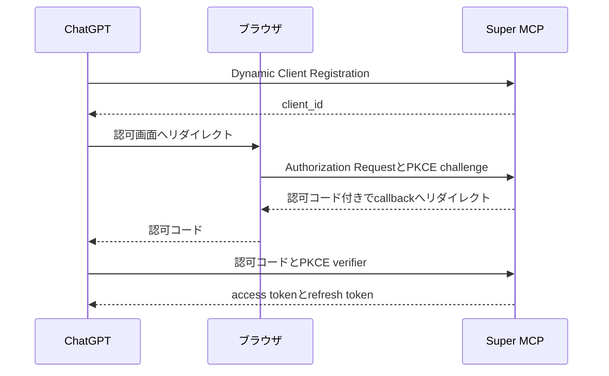
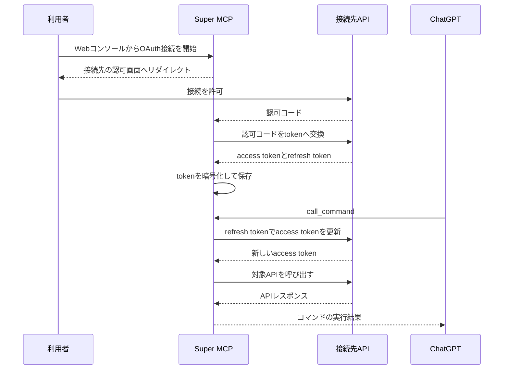

こちらの記事は「[MEDLEY Summer Tech Blog Relay](https://developer.medley.jp/entry/2026/07/09/234777/)」の12日目の記事です。

## はじめに

こんにちは、株式会社メドレーの高橋です。

メドレーは「医療ヘルスケアの未来をつくる」をミッションに掲げ、テクノロジーを活用した事業やプロジェクトを通じて「納得できる医療」の実現を目指しています。

人材プラットフォーム事業と医療プラットフォーム事業を展開し、医療、介護、福祉領域の人材採用や、医療機関と患者を支えるプロダクトを提供しています。

本記事で紹介するSuper MCPは、業務外で開発している個人プロジェクトです。

個人開発で小さなAPIを作ることが増えました。

WebページをMarkdownへ変換するAPI、各種サービスのデータをGoogle Sheetsへ同期するAPIなど、用途はそれぞれ異なります。

これらをChatGPTから呼べるようにするには、APIごとにMCP endpointを実装し、ChatGPTの開発者モードへ追加すれば実現できます。

最初の一つはこの方法で困りませんでした。

しかしAPIが増えると、MCP endpointやOAuthの実装、ChatGPTへの接続設定をその都度用意することになります。

そこで、ChatGPTには一つのMCPサーバーだけを接続し、その先へ任意のAPIを追加できる仕組みを作りました。

名前は「Super MCP」です。

本記事では、Super MCPを作った背景と全体構成、OpenAPIからMCPコマンドを生成する仕組み、二方向のOAuthを扱うための設計について紹介します。

なお、タイトルにある「任意のAPI」は、OpenAPIで記述できるHTTP APIを指します。

## 背景：APIごとに増えていたMCPの実装

ChatGPTの開発者モードでは、独自のMCPサーバーをアプリとして登録してテストできます。

登録時にはMCP endpointと認証方式を設定し、ChatGPTが公開されているMCPツールを読み取ります。

詳しい手順と利用条件は[OpenAIの公式ヘルプ](https://help.openai.com/en/articles/12584461-developer-mode-and-mcp-apps-in-chatgpt)にまとまっています。

私はこの機能を使い、自作したMCPサーバーを自分用のアプリとして追加していました。

作ったMCPサーバーをApp Directoryへ公開していたわけではありません。

この方法では、自作APIとChatGPTが一対一で対応します。

たとえば三つのAPIを使う場合は、三つのMCP endpointと三つの接続設定を管理します。

接続先APIがOAuthを要求する場合は、access tokenの取得、保存、更新もそれぞれに必要です。

整理すると、APIを一つ追加するたびに次の作業が発生していました。

- MCP endpointを実装する
- ChatGPTへ接続するためのOAuthを実装する
- 開発者モードで接続先を追加する
- 接続先APIのAPIキーやOAuth tokenを管理する

ここでの問題は、MCPサーバーの実装自体が難しいことではありません。

どのAPIもChatGPTとの接続と接続先への認証を必要とし、同じような実装をAPIごとに持たせていたことです。

## 実現したいこと

APIごとの重複を減らすため、次の状態を目指しました。

- ChatGPTへ登録するMCPサーバーは一つにする
- 新しいAPIはWebコンソールから追加できるようにする
- OpenAPIからChatGPTが呼び出せる操作を生成する
- APIキーやOAuth tokenをChatGPTへ渡さずに認証する

このように、別のAPIを後から組み込めるMCPサーバーを、本記事では**メタMCP**と呼びます。

## Super MCPの全体構成

Super MCPは、ChatGPTと複数のHTTP APIの間に置くMCPサーバーです。

WebコンソールからAPIのベースURL、OpenAPI、接頭辞、認証情報を登録すると、そのAPIをMCPコマンドとして利用できるようになります。


ChatGPTから見える接続先はSuper MCPだけです。

APIを追加したときに更新するのはSuper MCPの設定であり、ChatGPTへ新しいMCPサーバーを登録する必要はありません。

Super MCPはCloudflare Workers上で動かしています。

MCP endpointと管理APIにはHonoを使い、アカウント、API設定、OAuth client、認可コード、tokenはD1へ保存しました。

WebコンソールはNext.jsをOpenNextで変換し、Worker Assetsから配信しています。

単なるHTTPプロキシではなく、利用者ごとの接続設定と認証状態を持ち、OpenAPIからコマンドを生成して外部APIを呼び出す構成です。

### 対象とするAPI

Super MCPへ登録できるAPIには、次の条件があります。

- HTTPで呼び出せる
- OpenAPIで操作を記述できる
- 固定ヘッダーまたはOAuth 2.0で認証できる

OpenAPIを持たないAPIや、MCPのresource、prompt、samplingといった機能を使うサーバーは対象外です。

Super MCPはMCPサーバーを任意に多段接続する仕組みではなく、OpenAPIで記述されたHTTP APIをMCPから呼び出せる形へ変換する仕組みです。

## OpenAPIからMCPコマンドを生成する

接続先ごとの実装を減らすため、Super MCPはOpenAPIをAPIとの契約として使います。

たとえば、次のようなoperationがあるとします。

```yaml
paths:
  /fetch:
    post:
      operationId: fetchPage
      summary: URLから本文を取得する
      requestBody:
        required: true
        content:
          application/json:
            schema:
              type: object
              properties:
                url:
                  type: string
                  format: uri
              required: [url]
      responses:
        '200':
          description: 取得結果
```

接頭辞として`page-kit`を設定すると、Super MCPはこのoperationを`page-kit__fetchPage`というコマンドへ変換します。

コマンド名には`operationId`を使い、複数API間の衝突を避けるために接頭辞を付けます。

入力スキーマはpath、query、header、request bodyから組み立てます。

responseにJSON Schemaがあれば、MCPツールの出力スキーマにも変換します。

MCPのツール定義が持つ`inputSchema`や`annotations`については、[MCPのTools仕様](https://modelcontextprotocol.io/specification/2025-11-25/server/tools)を参照してください。

実行時には引数をOpenAPI上の位置へ振り分け、HTTPリクエストを作ります。

```json
{
  "name": "page-kit__fetchPage",
  "arguments": {
    "requestBody": {
      "url": "https://example.com"
    }
  }
}
```

この例では、Super MCPが`POST /fetch`のJSON bodyへ`requestBody`を入れます。

Webコンソールで登録した認証ヘッダーは入力スキーマから除外し、APIを呼び出す直前にSuper MCPが付与します。

これにより、モデルへAPIキーを渡したり、利用者がプロンプトへ認証情報を書いたりする必要がなくなります。

### OpenAPIを変換するときの落とし穴

実装時には、OpenAPIを単純に走査するだけでは扱えない箇所がありました。

まず、OpenAPIの`paths`配下にあるキーが、すべてHTTPメソッドとは限りません。

Path Itemには`parameters`、`summary`、`description`、`$ref`も置けるため、HTTPメソッドだけを選ばずにparseすると正しい定義まで弾いてしまいます。

path階層とoperation階層の両方に`parameters`がある場合は、後者で前者を上書きする形でマージする必要もあります。

URLの解決にも罠がありました。

```ts
new URL('openapi.json', 'https://api.example.com/v1').toString()
// https://api.example.com/openapi.json
```

ベースURLの末尾に`/`がなければ、`v1`はディレクトリではなくファイル名として扱われます。

Super MCPではベースURLを正規化してからOpenAPIの相対パスを解決しています。

汎用的な変換処理では、こうした例外を接続先ごとの修正へ逃がせません。

同じ入力から同じコマンドを生成できるよう、`operationId`の欠落と重複も登録時にエラーとしています。

## MCPツールの数を固定する

OpenAPIのoperationをそのままMCPツールとして公開する実装も試しました。

この方式は単純ですが、APIを追加するたびに`tools/list`の結果が増えます。

各ツールには名前と説明だけでなく入力スキーマも含まれるため、接続先を増やすほどChatGPTへ渡す定義も大きくなります。

そこで、現在のSuper MCPが直接公開するMCPツールを次の二つに固定しました。

- `list_commands`：利用できるコマンドと入力スキーマを返す
- `call_command`：コマンド名と引数を受け取り、対象APIを呼び出す

モデルは`list_commands`で利用可能な操作を調べ、選んだコマンドを`call_command`へ渡します。

APIを追加しても、MCPツールの名前と役割は変わりません。

| 方式 | MCPツール数 | API追加時の変化 | API呼び出しまで |
| --- | --- | --- | --- |
| operationを直接公開 | operationごとに一つ | ツールが増える | 一回 |
| 現在のSuper MCP | 二つで固定 | コマンドが増える | 一覧取得後に実行 |

ただし、この実装で固定できたのはMCPツールの数だけです。

現在の`call_command`は、登録済みコマンドの入力スキーマを`oneOf`に含めています。

そのため、`tools/list`で渡すスキーマの総量はAPIの追加に応じて増えます。

ツール数とコンテキスト量は別の問題でした。

### 入力スキーマを遅延取得する案

この問題を改善するなら、次の三つへ分ける設計が考えられます。

- `list_commands`：コマンド名と説明だけを返す
- `describe_command`：指定したコマンドの入力スキーマを返す
- `call_command`：コマンド名と汎用的なobject型の引数を受け取る

`list_commands`に説明を残せば、モデルは候補を選んでから必要なコマンドだけを`describe_command`で確認できます。

すべての入力スキーマを、最初からMCPツールの定義へ含める必要はありません。

一方で、コマンドの一覧、詳細、実行という最大三回のツール呼び出しが必要になります。

モデルが`describe_command`を省略する可能性もあるため、Super MCPは`call_command`の引数を対象operationのスキーマで検証し、修正可能なエラーを返す必要があります。

これはまだ実装していません。

現在の二ツール構成で分かった限界と、次に試したい設計です。

## 二方向のOAuthを分離する

Super MCPには二つのOAuthがあります。

一つはChatGPTからSuper MCPへの認証であり、もう一つはSuper MCPから接続先APIへの認証です。

両者は別のauthorization codeとtokenを持つため、一つの中継処理として扱うとtokenの発行者と利用先が分かりにくくなります。

そこでSuper MCPは、ChatGPTに対してはOAuth認可サーバーとして、接続先APIに対してはOAuthクライアントとして振る舞うようにしました。

### ChatGPTからSuper MCPへの認証

ChatGPTに対して実装したのは、Dynamic Client Registration、Authorization Code、PKCE、access tokenとrefresh tokenの発行です。

MCPにおけるOAuthの役割と要件は、[MCPのAuthorization仕様](https://modelcontextprotocol.io/specification/2025-11-25/basic/authorization)に記載されています。



ChatGPTが取得したaccess tokenは、Super MCPのMCP endpointを呼ぶためにだけ使います。

接続先APIへこのtokenを転送することはありません。

### Super MCPから接続先APIへの認証

接続先APIに対して、Super MCPはOAuthクライアントとして振る舞います。

利用者がWebコンソールから接続を開始すると、Super MCPは接続先の認可画面へリダイレクトします。

callbackで受け取ったauthorization codeをtokenへ交換し、access tokenとrefresh tokenを暗号化して保存します。



access tokenの期限が切れていれば、Super MCPがrefresh tokenで更新してからAPIを呼びます。

固定ヘッダーで認証するAPIではOAuthを使わず、登録したヘッダーを同じタイミングで付与します。

OAuth client secret、access token、refresh tokenはAES-256-GCMで暗号化してD1へ保存しました。

固定ヘッダーの値は設定ごとに暗号化を選べるため、APIキーには暗号化を有効にしています。

暗号鍵はCloudflare WorkersのSecretに置き、D1には保存していません。

## 個人利用に限定している理由

Super MCPはChatGPTの開発者モードから個人利用しており、App Directoryへ提出していません。

任意のURLと認証情報を登録できるアプリは、公開時に許可するアクセス先と権限を固定しにくいためです。

接続先を一箇所へ集約すると設定の重複は減りますが、Super MCPが侵害された場合に影響する認証情報も集約されます。

接続先APIが返す内容を信頼できなければ、プロンプトインジェクションの経路にもなり得ます。

OpenAIも、開発者モードでは信頼できるMCPサーバーだけへ接続し、作成者が安全性を確認するよう[注意を促しています](https://help.openai.com/en/articles/12584461-developer-mode-and-mcp-apps-in-chatgpt)。

Super MCPには、公開サービスとして必要になる次の機能がまだありません。

- 外向き通信の宛先制限
- 接続先ごとの監査ログ
- コマンド単位の権限制御
- 利用者へ許可内容を示す仕組み

また、OpenAPIからAPI固有の意味を完全には復元できません。

現在はGET、HEAD、OPTIONSを読み取り操作とみなし、それ以外へ更新操作のannotationを付けています。

この推定が正しいのは、接続先がHTTPメソッドの意味に従っている場合だけです。

実際に審査へ提出して却下されたわけではないため、「メタMCPは審査を通らない」とは断定できません。

しかし、現在の実装を不特定多数へ提供できる状態ではないと判断し、信頼できる自作APIだけを登録しています。

## まとめ

本記事では、複数の自作APIをChatGPTから利用するために作ったSuper MCPを紹介しました。

Super MCPを導入してからは、新しいHTTP APIを作るたびに専用のMCPサーバーを実装する必要がなくなりました。

OpenAPIと認証情報を登録すれば、すでに接続済みのSuper MCPから呼び出せます。

この仕組みが向くのは、同じ利用者が複数の自作APIを短い周期で追加する場合です。

一つのAPIだけを公開する場合や、MCP固有のresource、prompt、samplingを使う場合は、専用MCPサーバーのほうが単純です。

メタMCPは専用MCPサーバーを置き換える一般解ではありません。

私にとっては、APIを作ってからChatGPTで試すまでの重複を減らす個人用の基盤になりました。

一方で、ツール定義の総量と、集約した権限を安全に管理する課題は残っています。

次に改善するなら、`describe_command`による入力スキーマの遅延取得と、コマンド単位の権限制御から着手する予定です。

MEDLEY Summer Tech Blog Relay 13日目の記事は山下さんです。

明日もお楽しみに！
