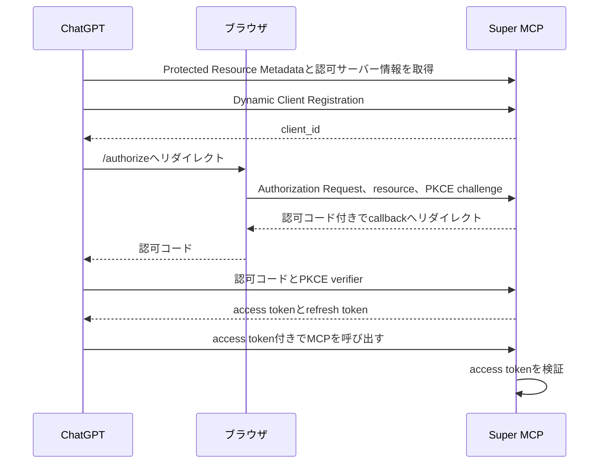
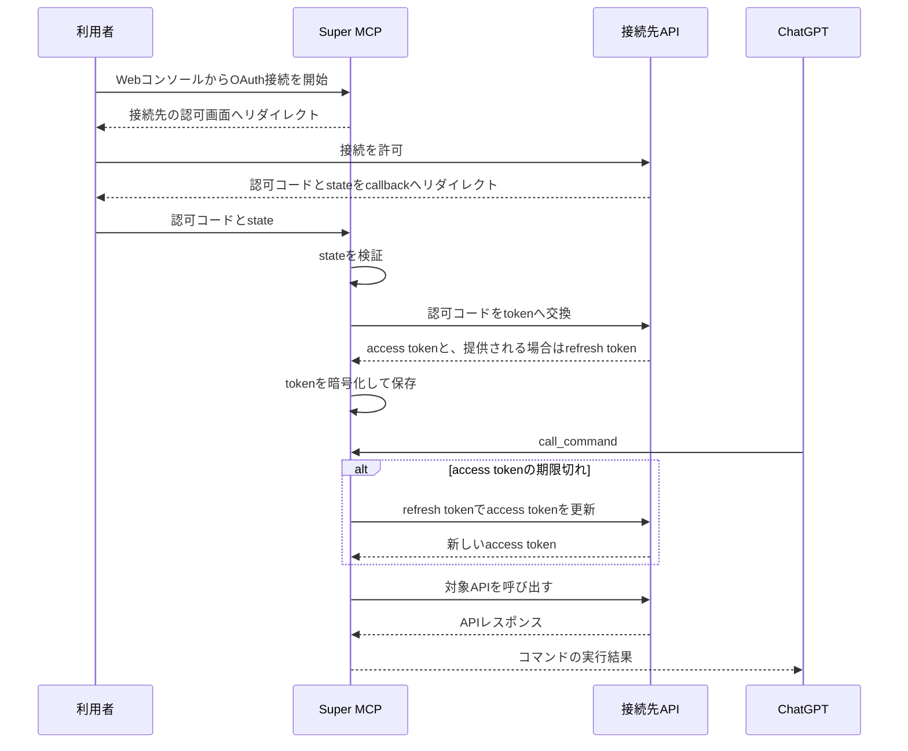

こちらの記事は「[MEDLEY Summer Tech Blog Relay](https://developer.medley.jp/entry/2026/07/09/234777/)」の12日目の記事です。

## はじめに

こんにちは、株式会社メドレーの高橋です。

メドレーは「医療ヘルスケアの未来をつくる」をミッションに掲げ、テクノロジーを活用した事業やプロジェクトを通じて「納得できる医療」の実現を目指しています。人材プラットフォーム事業と医療プラットフォーム事業を展開し、医療、介護、福祉領域の人材採用や、医療機関と患者を支えるプロダクトを提供しています。

本記事では、業務外で開発している個人用基盤「Super MCP」について紹介します。Super MCPはChatGPTから自作APIを気軽に使えるようにするための基盤です。Super MCPを作った背景と全体構成、OpenAPIからMCPコマンドを生成する仕組み、二方向のOAuthを扱うための設計について紹介します。

## 背景

以前、個人開発で食事記録やトレーニング履歴を取得するAPIを作っていました。これらのAPIをChatGPTから呼べるようにするには、APIごとにMCP endpointを実装し、ChatGPTの開発者モードへ追加すれば実現できます。

ChatGPTの開発者モードでは、独自のMCPサーバーをアプリとして登録してテストできます。登録時にはMCP endpointと認証方式を設定し、ChatGPTが公開されているMCPツールを読み取ります。詳しい手順と利用条件は[OpenAIの公式ヘルプ](https://help.openai.com/en/articles/12584461-developer-mode-and-mcp-apps-in-chatgpt)にまとまっています。私はこの機能を使い、自作したMCPサーバーを自分用のアプリとして追加していました。

私の当初の構成では、APIを一つ追加するたびに次の作業が発生していました。

- MCP endpointを実装する
- ChatGPTへ接続するためのOAuthを実装する
- 開発者モードで接続先を追加する
- 接続先APIのAPIキーやOAuth tokenを管理する

ここでの問題は、MCPサーバーの実装自体が難しいことではありません。ChatGPTとの接続に加え、認証が必要なAPIでは接続先のtoken管理もあり、**同じような実装をAPIごとに持たせていたこと**です。

## 実現したいこと

APIごとの重複を減らすため、次の状態を目指しました。

- ChatGPTへ登録するMCPサーバーは一つにする
- 新しいAPIはWebコンソールから追加できるようにする
- OpenAPIでChatGPTが呼び出せる操作を定義する
- APIキーやOAuth tokenをChatGPTへ渡さずに認証する

このように、別のAPIを後から組み込めるMCPサーバーをSuper MCPとして実装しました。また、OpenAPIから生成する内部操作を**コマンド**と呼び、MCPクライアントへ直接公開するtoolと区別します。

## Super MCPの全体構成

Super MCPは、Webコンソール、MCP endpoint、コマンドの生成と実行を担うWorker、設定と認証情報を保存するD1で構成されており、すべてCloudflare上で完結しています。


WebコンソールでAPIのbaseURL、OpenAPI、名前、認証情報を登録すると、Super MCPへ接続設定が保存されます。ChatGPTから呼び出しを受けたWorkerは、登録されたOpenAPIから対象のoperationを特定し、HTTPリクエストを組み立てて接続先APIへ送ります。

MCP endpointと管理APIにはHonoを使っています。WebコンソールはNext.js+OpenNextで構築しています。

### 利用例：トレーニング履歴を振り返る

Super MCPには食事記録APIとトレーニング履歴APIを登録しています。たとえば、ChatGPTへ次のように依頼します。

> @Super 直近4週間のトレーニング履歴から、ベンチプレスの重量と回数の推移を整理し、次回の目安を考えてください。

ChatGPTは `list_commands` ツールで利用できる操作を調べ、トレーニング履歴を取得するコマンドを　`call_command` ツールから実行します。Super MCPは保存してあるAPIキーをリクエストへ付与してくれます。

ここで共通化したのは、APIの処理そのものではなく、ChatGPTから各APIへ接続し、認証情報を付与する仕組みです。新しい自作APIを追加するときは、専用のMCP endpointとOAuthを実装する代わりに、OpenAPIと認証情報をSuper MCPへ登録します。なお認証情報はAES-256で暗号化され保存されます。

:::message info

Super MCPはMCPをまとめ上げる存在ではなく、REST APIをまとめ上げる存在です。

:::

## OpenAPIからMCPコマンドを生成する

Super MCPは、登録されたOpenAPIの各operationを内部のコマンドへ変換します。トレーニング履歴APIには、履歴をページ単位で取得する次のoperationがありました。

```yaml
paths:
  /workouts:
    get:
      operationId: listWorkouts
      summary: トレーニング履歴を取得する
      parameters:
        - in: header
          name: api-key
          required: true
          schema:
            type: string
        - in: query
          name: page
          required: true
          schema:
            type: integer
      responses:
        '200':
          description: トレーニング履歴
          content:
            application/json:
              schema:
                type: object
                properties:
                  workouts:
                    type: array
                    items:
                      type: object
```

APIの名前として`training`を設定すると、Super MCPはこのoperationを`training__listWorkouts`というコマンドへ変換します。コマンド名には`operationId`を使い、複数API間の衝突を避けるために登録した名前を接頭辞として付けます。

入力スキーマはpath、query、header、request bodyから組み立てます。ただし、Webコンソールで登録した認証ヘッダーは入力スキーマから除外します。この例では`page`だけがモデルへ渡す引数になり、`api-key`は含まれません。

選択した2xx responseまたはdefault responseの`application/json`にJSON Schemaがあれば、内部コマンドの出力スキーマとして保持します。

:::details outputSchemaに残る仕様不整合
現在の二tool構成では、operationごとの`outputSchema`をMCP toolとして直接公開していません。

また、`list_commands`と`call_command`は`outputSchema`を宣言している一方で、実行結果を`structuredContent`ではなくtext contentだけで返しています。MCP仕様では`outputSchema`を宣言したtoolは適合するstructured resultを返す必要があるため、この部分は**未修正の仕様不整合**です。

MCPのツール定義が持つ`inputSchema`や`annotations`については、[MCPのTools仕様](https://modelcontextprotocol.io/specification/2025-11-25/server/tools)を参照してください。
:::

実行時には引数をOpenAPI上の位置へ振り分け、HTTPリクエストを作ります。

```json
{
  "name": "training__listWorkouts",
  "arguments": {
    "page": 1
  }
}
```

この呼び出しを受けると、Super MCPは`page`をquery parameterへ変換し、`GET /workouts?page=1`を組み立てます。APIを呼び出す直前に、保存してあるAPIキーを`api-key`ヘッダーへ付与します。これにより、接続先APIのAPIキーをモデルへ渡したり、利用者がプロンプトへ認証情報を書いたりする必要がなくなります。

:::details OpenAPIを変換するときの落とし穴

実装時には、OpenAPIを単純に走査するだけでは扱えない箇所がありました。まず、OpenAPIの`paths`配下にあるキーが、すべてHTTPメソッドとは限りません。Path Itemには`parameters`、`summary`、`description`、`$ref`も置けるため、HTTPメソッドだけを選ばずにparseすると正しい定義まで弾いてしまいます。path階層とoperation階層の両方に`parameters`がある場合は、後者で前者を上書きする形でマージする必要もあります。

URLの解決にも罠がありました。

```ts
new URL('openapi.json', 'https://api.example.com/v1').toString();
// https://api.example.com/openapi.json
```

ベースURLの末尾に`/`がなければ、`v1`はディレクトリではなくファイル名として扱われます。Super MCPではベースURLを正規化してからOpenAPIの相対パスを解決しています。

汎用的な変換処理では、こうした例外を接続先ごとの修正へ逃がせません。同じ入力から同じコマンドを生成できるよう、`operationId`の欠落と重複も登録時にエラーとしています。

OpenAPIから操作の安全性をどこまで推定できるかも課題です。現在はOpenAPIから生成するコマンドについて、GET、HEAD、OPTIONSへ`readOnlyHint: true`と`destructiveHint: false`を付け、それ以外を更新操作として扱っています。これらのannotationはMCPクライアントへ性質を伝えるヒントであり、**権限制御ではありません**。

さらに、直接公開する`call_command`は読み取りと更新の両方を束ねるため、tool自体には`destructiveHint: true`を付けています。コマンドごとのannotationは`list_commands`の結果に含まれるだけで、MCP tool単位の確認制御にはなりません。接続先APIがHTTPメソッドの意味に従っていなければ推定も外れるため、公開時にはコマンド単位の許可設定が別に必要です。
:::

## MCPツールの数を固定する

OpenAPIのoperationをそのままMCPツールとして公開する実装も試しました。この方式は単純ですが、APIを追加するたびに`tools/list`の結果が増えます。各ツールには名前と説明だけでなく入力スキーマも含まれるため、接続先を増やすほどChatGPTへ渡す定義も大きくなります。

当時はコンテキスト量の削減よりも、**APIを追加しても公開toolの名前と呼び出し方法を変えないこと**を優先しました。そこで、現在のSuper MCPが直接公開するMCPツールを次の二つに固定しました。

- `list_commands`：利用できるコマンドと入力スキーマを返す
- `call_command`：コマンド名と引数を受け取り、対象APIを呼び出す

モデルは`list_commands`で利用可能な操作を調べ、選んだコマンドを`call_command`へ渡します。

| 方式                | MCPツール数         | API追加時の変化  | API呼び出しまで  |
| ------------------- | ------------------- | ---------------- | ---------------- |
| operationを直接公開 | operationごとに一つ | ツールが増える   | 一回             |
| 現在のSuper MCP     | 二つで固定          | コマンドが増える | 一覧取得後に実行 |

ただし、この実装で固定できたのはMCPツールの数だけです。現在の`call_command`は、登録済みコマンドの入力スキーマを`oneOf`に含めています。そのため、`tools/list`で渡すスキーマの総量はAPIの追加に応じて増えます。**ツール数とコンテキスト量は別の問題でした**。

この方式によるスキーマ量、呼び出し回数、応答時間の改善はまだ計測していません。そのため、現在の構成について主張できるのはtool名を二つに固定できたことまでです。

:::details 入力スキーマを遅延取得する案

この問題を改善するなら、次の三つへ分ける設計が考えられます。

- `list_commands`：コマンド名と説明だけを返す
- `describe_command`：指定したコマンドの入力スキーマを返す
- `call_command`：コマンド名と汎用的なobject型の引数を受け取る

`list_commands`に説明を残せば、モデルは候補を選んでから必要なコマンドだけを`describe_command`で確認できます。すべての入力スキーマを、最初からMCPツールの定義へ含める必要はありません。

一方で、コマンドの一覧、詳細、実行という最大三回のツール呼び出しが必要になります。モデルが`describe_command`を省略する可能性もあるため、Super MCPは`call_command`の引数を対象operationのスキーマで検証し、修正可能なエラーを返す必要があります。これはまだ実装していません。現在の二ツール構成で分かった限界と、次に試したい設計です。
:::

## 二方向のOAuthを分離する

Super MCPには二つのOAuthがあります。一つはChatGPTからSuper MCPへの認証であり、もう一つはSuper MCPから接続先APIへの認証です。両者は別のauthorization codeとtokenを持つため、一つの中継処理として扱うとtokenの発行者と利用先が分かりにくくなります。そこでSuper MCPは、ChatGPTに対しては**MCPリソースサーバー兼OAuth認可サーバー**として、接続先APIに対しては**OAuthクライアント**として振る舞うようにしました。

### ChatGPTからSuper MCPへの認証

ChatGPTをクライアントとする認可フローは次の通りです。MCPにおけるOAuthの役割と要件は、[MCPのAuthorization仕様](https://modelcontextprotocol.io/specification/2025-11-25/basic/authorization)に記載されています。

図はChatGPTとの接続で使われたDynamic Client Registration構成を簡略化したものです。Dynamic Client Registrationは**MCPの必須要件ではなく**、現行仕様では複数あるclient registration方式の一つです。



ChatGPTが取得したaccess tokenは、Super MCPのMCP endpointを呼ぶためにだけ使います。接続先APIへこのtokenを転送することはありません。

:::details 現行MCP Authorization仕様との差分

Super MCPはChatGPTから接続できていますが、執筆時点の実装はMCP Authorization仕様2025-11-25へ**完全には適合していません**。現在は認可requestの`resource`を任意としており、token requestでは`resource`を受け取らず、発行したaccess tokenにもaudienceを保持していません。

また、PKCEなしの認可と`plain`方式を許可し、Dynamic Client Registrationでは登録可能なredirect URIを十分に制限していません。ログイン済みの利用者に明示的な同意画面を出さず、認可コードを発行する点も公開サービスには不向きです。

公開する前には、認可requestとtoken requestの両方で`resource`を必須にしてaudienceを検証し、PKCEをS256へ限定する必要があります。redirect URIの制限と、認可対象を確認する同意画面も必要です。
:::

### Super MCPから接続先APIへの認証

接続先APIに対して、Super MCPはOAuthクライアントとして振る舞います。Webコンソールから始める接続先APIとの認可フローは次の通りです。



access tokenの期限が切れていれば、Super MCPがrefresh tokenで更新してからAPIを呼びます。固定ヘッダーで認証するAPIではOAuthを使わず、登録したヘッダーを同じタイミングで付与します。

OAuth client secret、access token、refresh tokenはAES-256-GCMで暗号化してD1へ保存しました。固定ヘッダーの値は設定ごとに暗号化を選べるため、APIキーには暗号化を有効にしています。暗号鍵はCloudflare WorkersのSecretに置き、D1には保存していません。

この暗号化はD1だけが流出した場合の保護であり、**復号権限を持つWorker自体が侵害された場合には認証情報を守れません**。

## 個人利用に限定している理由

Super MCPはChatGPTの開発者モードから個人利用しており、**App Directoryへ提出していません**。任意のURLと認証情報を登録できるアプリは、公開時に許可するアクセス先と権限を固定しにくいためです。

:::message alert
現在は外向き通信の宛先を制限していないため、登録する接続先は信頼できる自作APIに限定しています。
:::

この設計では認証情報が一箇所に集まるため、Super MCPが侵害された場合は複数の接続先へ影響します。接続先APIが返す内容を信頼できなければ、プロンプトインジェクションの経路にもなり得ます。OpenAIも、開発者モードでは信頼できるMCPサーバーだけへ接続し、作成者が安全性を確認するよう[注意を促しています](https://help.openai.com/en/articles/12584461-developer-mode-and-mcp-apps-in-chatgpt)。

:::details 公開する前に必要な安全対策
登録されたURLをWorkerから取得する機能は**SSRFの入口**になります。公開するなら、schemeとhostのallowlist、private addressの拒否、redirectごとの再検証が必要です。

Super MCPには、公開サービスとして必要になる次の機能がまだありません。

- 接続先ごとの監査ログ
- コマンド単位の権限制御
- 利用者へ許可内容を示す仕組み

Webコンソール自体はメールアドレスとパスワードで認証し、接続設定をアカウント単位で分離しています。ただし、これは不特定多数へ公開するための宛先制御やコマンド単位の認可を代替しません。
:::

実際に審査へ提出して却下されたわけではないため、「Super MCPは審査を通らない」とは断定できません。しかし、現在の実装を不特定多数へ提供できる状態ではないと判断しています。

## まとめ

Super MCPによって、自作APIごとに用意していたChatGPTとの接続部分を一つにまとめられました。この仕組みが向くのは、同じ利用者が複数の自作APIを短い周期で追加する場合です。一つのAPIだけを公開する場合は、専用MCPサーバーのほうが単純です。したがって、Super MCPは専用MCPサーバーを置き換える一般解ではなく、**自作APIを試すまでの重複を減らす個人用の基盤**と位置付けています。

一方で、MCP Authorization仕様への適合、tool resultの形式、外向き通信の制限、集約した権限の管理には課題が残っています。次に改善するなら、認可とtool resultの仕様不整合を先に修正します。その後、`describe_command`による入力スキーマの遅延取得と、コマンド単位の権限制御へ進む予定です。

MEDLEY Summer Tech Blog Relay 13日目の記事は山下さんです。明日もお楽しみに！
