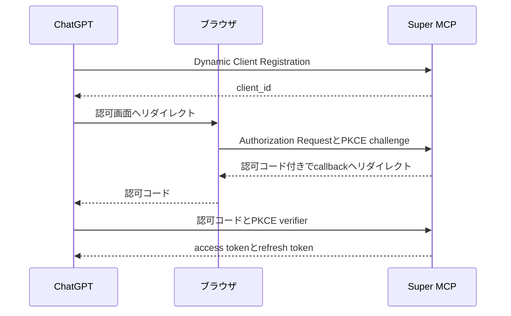
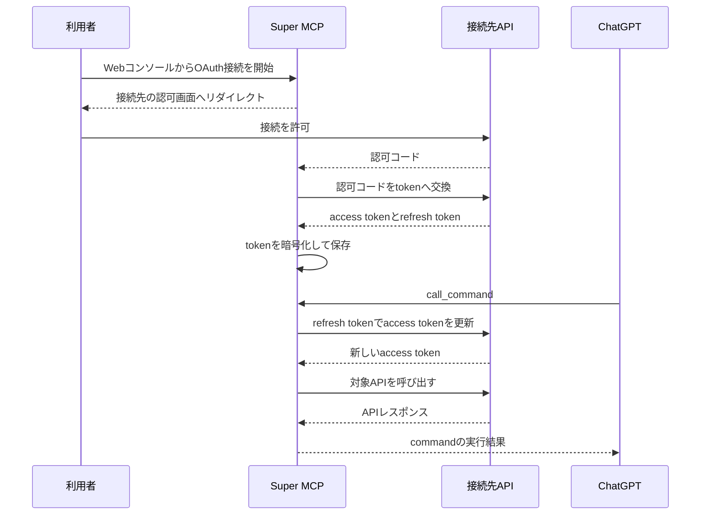

<!--
この記事はプロット段階。
各節の「主張」「材料」「着地点」を本文へ展開する。
-->

## ChatGPTから自作APIを呼ぶまでの手間

### 主張

MCPサーバーを一つ作るだけなら難しくないが、自作APIの数だけMCPサーバーを用意すると、接続設定、認証、利用時の管理が重複する。

### 材料

- 以前、食事記録やトレーニング履歴を取得する自作APIを運用していた。
- 自作APIをChatGPTから呼ぶために、それぞれへMCP endpointを実装していた。
- 作ったMCPは公開せず、ChatGPTの開発者モードから自分用のコネクターとして追加していた。
- MCPサーバーごとに、開発者モードで接続設定を追加する必要があった。
- APIキーやOAuthを使う接続先では、認証情報の保存と更新も個別に実装する必要がある。

### 着地点

API本体を作る作業とは別に、ChatGPTから利用可能にするための実装と設定がAPIごとに増えていた。

ここで扱う問題は「MCPサーバーの実装が難しい」ことではない。
同じ接続機構と認証機構を、自作APIの数だけ保守することにある。

## 一つのMCPから複数のAPIを呼び出す

### 主張

ChatGPTには一つのMCPサーバーだけを接続し、そのMCPサーバーへ後からAPIを登録できれば、APIごとの接続設定を減らせる。

この役割を担うMCPサーバーを**Super MCP**として実装した。

### 材料

- 作ったサービスの名前は「Super MCP」。
- Webコンソールから接続先のベースURL、OpenAPI、認証方式を登録する。
- ChatGPTはSuper MCPだけに接続する。
- Super MCPがOpenAPIを読み、対象APIへのリクエストを組み立てる。
- 新しいAPIを追加しても、ChatGPT側へ別のMCPサーバーを登録する必要はない。

### 図

次の流れを一枚の構成図にする。

`ChatGPT → Super MCP → 複数のHTTP API`

図にはWebコンソール、OpenAPI、認証情報の保存先も含める。
構成図はdraw.ioで作成し、`images/super-mcp-chatgpt/architecture.png`へ書き出す。

### 対象範囲

Super MCPは、次の条件を満たす自作APIを対象とする。

- HTTPで呼び出せる。
- OpenAPIで操作を記述できる。
- 認証に固定ヘッダーまたはOAuth 2.0を利用できる。

OpenAPIを持たないAPIや、MCP固有の機能を使うサーバーまで無条件に中継できるわけではない。

### 公開範囲

Super MCPもChatGPT Appsとして公開せず、開発者モードから個人利用している。

任意の接続先と認証情報を登録できるアプリは、公開アプリとして権限と安全性を説明しにくく、ChatGPT Appsの審査通過を期待できないと判断したためだ。

実際に審査へ提出して却下されたわけではないため、「汎用MCPは審査を通らない」とまでは主張しない。

## OpenAPIをMCPのコマンドへ変換する

### 主張

OpenAPIを接続先との契約として使うことで、APIごとのMCP実装を登録作業へ置き換えた。

### 材料

- `operationId`からコマンド名を作る。
- 複数API間の名前衝突を避けるため、設定したprefixをコマンド名へ付ける。
- path、query、header、request bodyから入力スキーマを組み立てる。
- response schemaがあれば出力スキーマへ変換する。
- GET、HEAD、OPTIONSは読み取り操作としてMCP annotationsを付ける。
- 登録済みの認証ヘッダーは入力スキーマから除外し、実行時にSuper MCPが付与する。

### 実例

小さなOpenAPI定義を掲載し、次のコマンドへ変換される様子を示す。

```txt
page-kit__fetchPage
```

入力値がpath、query、body、headerへ振り分けられ、最終的なHTTPリクエストになるまでを一つの例で追う。

### 実装で踏んだ罠

- Path ItemにはHTTPメソッド以外に`parameters`、`summary`、`description`、`$ref`も入る。
- path階層とoperation階層のparametersはマージする必要がある。
- `new URL("openapi.json", "https://example.com/v1")`は、期待に反して`/v1`を落とす。
- `operationId`の欠落や重複を許すと、呼び出す操作を一意に決められない。

罠を列挙するだけで終えず、それぞれが誤ったコマンド生成や別URLへの送信を起こす仕組みまで書く。

## ツール定義をどこまで遅延取得するか

### 主張

登録したoperationをすべてMCP toolとして公開すると、APIを追加するたびに`tools/list`の結果が増える。

現在のSuper MCPは公開するtoolを`list_commands`と`call_command`の二つに固定し、実際のoperationをその配下のコマンドとして扱う。

### 材料

- `list_commands`は、利用できるコマンドと入力スキーマを返す。
- `call_command`は、コマンド名と引数を受け取って対象APIを呼び出す。
- モデルは必要なコマンドを確認してから実行する。
- APIを追加しても、MCP toolの名前と役割は変わらない。

### 比較

変換前後を表で示す。

| 方式 | MCP tool | API追加時の変化 | 呼び出し手順 |
| --- | --- | --- | --- |
| operationを直接公開 | operationごとに一つ | toolが増える | 一回 |
| 現在の実装 | 二つで固定 | `oneOf`のschemaが増える | 一覧取得後に実行 |
| 改善案 | 三つで固定 | 一覧項目だけが増える | 一覧、詳細、実行の順 |

### 限定

現在の設計で固定できるのは、MCP toolの数である。

現在の`call_command`は登録済みコマンドの入力スキーマを`oneOf`に含めるため、`tools/list`で送るスキーマの総量まで一定になるわけではない。

コマンドの探索が一回増える点も含め、ツール数とコンテキスト量を同じ問題として扱わない。

### `describe_command`を加える改善案

入力スキーマを`describe_command`へ移せば、`tools/list`からコマンド固有のスキーマを除外できる。

三つのtoolの責務は次のように分ける。

- `list_commands`：コマンド名と説明だけを返す。
- `describe_command`：指定したコマンドの入力スキーマを返す。
- `call_command`：コマンド名と汎用的なobject型の引数を受け取り、サーバー側で対象operationに対して検証する。

`list_commands`に説明を残せば、モデルは候補を選んでから必要なコマンドだけを`describe_command`で確認できる。

これなら探索性を保ちながら、すべての入力スキーマを最初からMCP toolの定義へ埋め込まずに済む。

一方で、API呼び出しまでのtool callは最大三回になる。

モデルが`describe_command`を省略して`call_command`を呼ぶ場合もあるため、引数の検証と修正可能なエラー応答はSuper MCP側に残す。

コマンド固有のスキーマをMCPの`call_command`へ強制すること自体は必須ではない。
スキーマの役割を、モデルへの説明と実行時の検証に分ければよい。

## 二方向のOAuthをどう扱うか

### 主張

Super MCPはOAuthの中継器ではなく、ChatGPTに対しては認可サーバーとして、接続先APIに対してはOAuthクライアントとして振る舞う。

### 材料

認証を二つの流れに分けて説明する。

1. ChatGPTからSuper MCPへの認証
   - Dynamic Client Registration
   - Authorization Code
   - PKCE
   - access tokenとrefresh tokenの発行
2. Super MCPから接続先APIへの認証
   - WebコンソールからOAuth接続を開始
   - callbackでauthorization codeをtokenへ交換
   - 接続先のaccess tokenとrefresh tokenを保存
   - access tokenの期限切れ時にrefresh tokenで更新

### 秘密情報の扱い

- APIキー、client secret、access token、refresh tokenはAES-256-GCMで暗号化して保存する。
- 暗号鍵はCloudflare WorkersのSecretとして保持する。
- モデルへ返す設定値や入力スキーマには秘密情報を含めない。
- 認証ヘッダーはSuper MCPが外部APIを呼ぶ直前に復号して付与する。

### ChatGPTからSuper MCPへの認証

一つ目のOAuthフローはMermaidのシーケンス図で示す。



### Super MCPから接続先APIへの認証

二つ目のシーケンス図には、初回のOAuth接続と、期限切れ後のAPI呼び出しを続けて載せる。



## Cloudflare Workers上の実装

### 主張

Super MCPは認証状態と設定を持つため、HTTPリクエストを転送するだけの薄いプロキシではない。

### 材料

- APIとMCP endpointはHonoを使ったCloudflare Workerとして動かす。
- アカウント、接続設定、OAuth client、認可コード、tokenはD1へ保存する。
- フロントエンドはWorker Assetsから配信する。
- OpenAPIからMCP commandを生成し、同じWorker内で対象APIを呼び出す。

技術スタックの網羅的な紹介は避け、Super MCPの動作に関係する構成だけを書く。

## Super MCPが引き受けるリスク

### 主張

接続と認証を一箇所へ集約すると、実装の重複は減るが、権限と障害の影響もSuper MCPへ集中する。

### 材料

- Super MCPが侵害されると、登録した複数APIの認証情報が影響を受ける。
- 一つの障害が、Super MCP経由で利用するすべてのAPIを止める。
- OpenAPIが不正確なら、生成する入力スキーマやHTTPリクエストも不正確になる。
- API固有の意味や安全条件を、HTTPメソッドとOpenAPI schemaだけから完全には復元できない。
- `destructiveHint`の推定は、GETを読み取り操作として設計しているAPIに依存する。
- 任意の接続先へアクセスできる性質上、公開アプリとして許可する権限の範囲を固定しにくい。

### 対応と残る課題

- 保存する秘密情報を暗号化し、レスポンスへ返さない。
- 認証済みアカウント単位で接続設定を分離する。
- 読み取り操作と更新操作のannotationを生成する。
- ChatGPT Appsとして一般公開せず、開発者モードでの個人利用に限定する。
- ただし、権限の最小化、接続先ごとの監査ログ、コマンド単位の許可設定は今後の課題として残る。

「一つ接続すれば安全にあらゆるAPIを使える」とは主張しない。
Super MCPは接続設定を集約するが、接続先APIの権限設計までは代行できないためだ。

## MCPを追加する作業はどこまで減ったか

### 主張

Super MCPによって、自作APIごとにMCPサーバーを実装してChatGPTへ接続する作業を、OpenAPIと認証情報を登録する作業へ置き換えられた。

### 材料

- 効果があるのは、同じ利用者が複数の自作HTTP APIをChatGPTから使う場合。
- 一つのAPIだけを公開する場合や、MCP固有のresource、prompt、samplingを使う場合は、専用MCPサーバーのほうが単純になる。
- Super MCPは専用MCPサーバーを置き換える一般解ではなく、自作APIを短い周期で追加するための個人向け基盤として作った。

### 結び

APIをChatGPTから試すたびに配布用のMCPサーバーを増やす必要はなくなった。

一方で、ツール定義の総量と集約された権限の管理は残っている。

次に改善するなら、`describe_command`による入力スキーマの遅延取得と、コマンド単位の権限制御を優先する。
